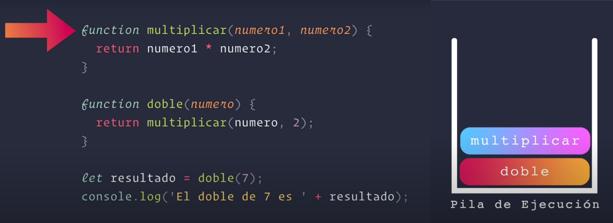

# CallStack (Pila de ejecución)

La **CallStack** está intamamente relacionado con conceptos más avanzados como el **Event Loop**, **Closures**, y los distintos **Scopes** que existen en las funciones. Estos conceptos son fundamentales para entender cómo JavaScript maneja la ejecución de código, especialmente en un entorno asíncrono.

Cuando se llama a una función, se agrega un nuevo marco (frame) a la pila. Cuando la función termina, su marco se elimina de la pila. Si una función llama a otra función, el marco de la función llamada se agrega encima del marco de la función que la llamó.

### ¿Qué es el Call Stack?

La **CallStack** es una estructura de datos que sigue el principio LIFO (Last In, First Out), lo que significa que el último elemento agregado es el primero en ser eliminado. En JavaScript, la CallStack se utiliza para gestionar las funciones que se están ejecutando en un momento dado.

El motor de JavaScript utiliza una **pila** para representar el CallStack, podemos pensar en una pila de platos donde el último plato en aplilar o colocar es el primero en ser retirado, no podemos poner un plato por el medio o debajo. De la misma manera si queremos sacar un elemento de la pila, debemos sacar el elemento que está arriba del todo, a las pilas también se lo conoce como **LIFO** (Last In First Out), el último en entrar, es el primero en salir. Lo que significa que cuando queremos sacar un elemento de la pila, tenemos que sacar el que está encima de todo, que fue el último que pusimos.

La pila de ejecución que tiene los motores de JavaScript, es como la pila de platos, pero en vez de platos, vamos a tener otra cosa, ¿Qué es lo que se vá apilar? y ¿Cómo funciona?.

<!--

  

<em>Figura 1. CallStack - Script</em>

-->
