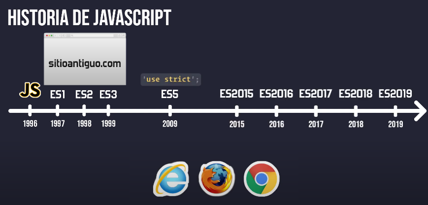
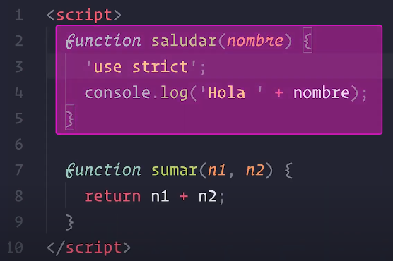

# Use Strict

#### ¿Que es Use Strict?

Es una instrucción dirigida al **intérprete** de JavaScript. Le indica que el código que sigue a continuación está en "**Modo estricto**", cambiando la manera en que se ejecutan algunas instrucciones.

En éste modo estámos más restringidos, no podemos realizar ciertas acciones que en el modo normal sí se permiten. El objetivo de éste modo es **hacer el código más seguro y evitar errores comunes**.

Si intentamos realizar lo siguiente:

```js
'use strict'

nombre = 'Juan' // Error: nombre no está definido
```

Esto es algo bueno, JavaScript convertirá nuestras equivocaciones como desarrolladores como errores, así podremos detectarlos antes de que lleguen a producción.

Modo estricto (strict mode) y modo descuidado (sloppy mode). Veremos las 10 caractrerísticas que tiene el modo estricto de JavaScript:

**ECMASCRIPT**
Es una especificación, un estándar para crear lenguajes de programación. JavaScript es una implementación de esa especificación.




<p align="center">
  
</p>
<p align="center"><em>Solo aplicará el modo estricto dentro de la función.</em></p>

1. Arregla la creación accidental de variables globales.
```js
let nombre = 'Gary'
let edad = 30

if (edad > 20) {
  nmbre = 'Pepito'
}

// Se agragará una variable global llamada nmbre
// Y como propiedad del objeto global
// window.nmbre = 'Pepito'
```

En modo estricto veremos un error de referencia por consola.

```js
'use strict'
let nombre = 'Gary'
let edad = 30

if (edad > 20) {
  nmbre = 'Pepito' // Error: nmbre is not defined
}
```

2. Los atributos de sólo lectura.

```js
const estudiante = {}

Object.defineProperty(estudiante, 'nombre', {
  value: 'Pepito',
  writable: false // No se puede modificar
})

estudiante.nombre = 'Juan'
console.log(estudiante.nombre) // Pepito
```

Seguimos teniendo el mismo valor pero 👁️ en modo estricto veremos un error de tipo por consola.

```js
'use strict'
const estudiante = {}
Object.defineProperty(estudiante, 'nombre', {
  value: 'Pepito',
  writable: false // No se puede modificar
})
estudiante.nombre = 'Juan' // ❌ Error: Cannot assign to read only property 'nombre' of object '#<Object>'
console.log(estudiante.nombre) // Pepito
```

3. Objetos no extendibles.

Algo similar sucede con los objetos no extendibles.

```js
const estudiante = {}
Object.preventExtensions(estudiante) // No se pueden agregar nuevas propiedades
estudiante.nombre = 'Pepito' // No se puede agregar
console.log(estudiante.nombre) // undefined
```

En modo estricto veremos un error de tipo por consola.

```js
'use strict'
const estudiante = {}
Object.preventExtensions(estudiante) // No se pueden agregar nuevas propiedades
estudiante.nombre = 'Pepito' // ❌ Error: Cannot add property nombre, object is not extensible
console.log(estudiante.nombre) // undefined
```

4. Variables primitivas.

```js
let nombre = 'Pepito'
nombre.edad = 30 // No se puede agregar propiedades a una cadena de texto
console.log(nombre.edad) // undefined
```

En modo estricto veremos un error de tipo por consola.

```js
'use strict'
let nombre = 'Pepito'
nombre.edad = 30 // ❌ Error: Cannot create property 'edad' on string 'Pepito'
console.log(nombre.edad) // undefined
```

5. No podemos tener **Parámetros duplicados en una función**

```js
function saludar(nombre, apellido, nombre) {
  console.log(`Hola ${nombre} ${apellido}`)
}
saludar('Juan', 'Pérez') // Hola undefined Pérez
```

En modo estricto veremos un error de sintaxis por consola.

```js
'use strict'
function saludar(nombre, apellido, nombre) { // ❌ SyntaxError: Duplicate parameter names not allowed in this context
  console.log(`Hola ${nombre} ${apellido}`)
}

// Veremos incluso el error antes de invocar a la función
```

6. Sistema octal

El sistema octal es el sistema de números con base 8. En él podemos representar cualquier número con **dígitos del 0 al 7**.

```js
console.log(011) // 1 + 1 * 8 = 9
console.log(023) // 3 + 2 * 8 = 19
```

En modo estricto veremos un error de sintaxis por consola.

```js
'use strict'
console.log(011) // ❌ SyntaxError: Octal literals are not allowed in strict mode.
...
```

Desde ES6 podemos usar el prefijo `0o` para representar números en base octal.

```js
console.log(0o11) // 1 + 1 * 8 = 9
console.log(0O23) // 3 + 2 * 8 = 19
```

7. Arreglamos errores silenciosos con el operador `delete`

El operador `delete` se utiliza para eliminar **propiedades de un objeto** o **elementos de un array** devolviéndonos `true` o `false` si se eliminó o no.

```js
function saludar() {
  console.log('Hola')
}

const nombre = 'Pepito'

delete nombre // No se puede eliminar una variable
delete saludar // No se puede eliminar una función
delete window // No se puede eliminar el objeto global
```

En modo estricto cualquiera de las instrucciones anteriores nos daría error si intentamos ejecutarlas.

```js
'use strict'
function saludar() {
  console.log('Hola')
}
const nombre = 'Pepito'

delete nombre // ❌ Error: Delete of an unqualified identifier in strict mode.
delete saludar // ❌ Error: Delete of an unqualified identifier in strict mode.
delete window // ❌ Error: Delete of an unqualified identifier in strict mode.
```

8. `arguments` y `eval` son keywords reservados (palabras reservadas)

```js
'use strict'
let arguments = 'Hola' // ❌ Error: Unexpected eval or arguments in strict mode
let eval = 123 // ❌ Error: Unexpected eval or arguments in strict mode
```

9. `with` no está permitido

El bloque `with` sirve para **extender la cadena de scopes** en JavaScript temporalmente.

Se usaba cuando teníamos que poner varias variables a un objeto que estaba muy anidado dentro de otro.

```js
with (document.forms[0]) {
  email.value = ''
  password.value = ''
}
```

Para no tener que repetir tanto código.

```js
// with (document.forms[0]) {
  document.forms[0].email.value = ''
  document.forms[0].password.value = ''
// }
```

Antes de ejecutar nuestro programa el **intérprete de JavaScript** lo analiza y arma ***la cadena de scopes*** sabiendo exáctamente a que lugar del código tiene que ir a buscar cada variable cuando la queremos usar.

De esta manera el motor de JavaScript puede ejecutarlo mucho mas rápido, pero como ésto depende de un objeto `document.forms[0]` que puede cambiar, el intérprete de JavaScript no puede saber a que lugar va a tener que buscar cada variable, antes de ejecutar el programa. La búsqueda la tendrá que hacer cuando se esté **ejecutando el programa**, no lo va a poder optimizar de antemano.

Por eso no está permitido utilizar `with` en modo estricto, para no perder ésa optimización.

De todas maneras esto lo podemos realizar guardando una referencia al objeto antes.

```js
const form = document.forms[0]
form.email.value = ''
form.password.value = ''
```

10. Nuevas **Palabras Reservadas**

En **ECMAScript5** se introdujeron nuevas palabras reservadas al lenguaje, es decir ***(No se pueden utilizar para nombrar `variables` ni `métodos`)***. Y en modo estricto se incorporan otras más.

**ECMAScript5 - Palabras Reservadas**

|   class   |    enum    |   extends  | super |
|-----------|------------|------------|-------|
| **const** | **export** | **import** |  |


**`use strict`**

|   implements   |    package    |   interface  |
|----------------|---------------|--------------|
|   **public**   |  **static**   | **private**  |
|  **protected** |   **yield**   |    **let**   |

Si intentamos nombrar una variable con éstas palabras reservadas como:

```js
'use strict'
let package = 'paquete 1' // ❌ Error: SyntaxError: Unexpected strict mode reserved word
// Incluso en la actualidad aunque package no se utiliza para nada en el lenguaje
```

>👀 Funciones libres (sin dueños)

```js
const estudiante = {
  nombre: 'Pepito',
  saludar: function() {
    console.log(`Hola, soy ${this.nombre}`)
  }
}

estudiante.saludar() // `estudiante` es -> `this`

// Si copiamos una referencia de la función a otra variable
const saludar = estudiante.saludar
saludar() // Pasa al objeto global `window.saludar()`, `window` -> `this`

// en Modo estricto el dueño no estará definido `this` -> `undefined`
```

🚨 Para el modo `module` esta habilitado por defecto `use strict`.

