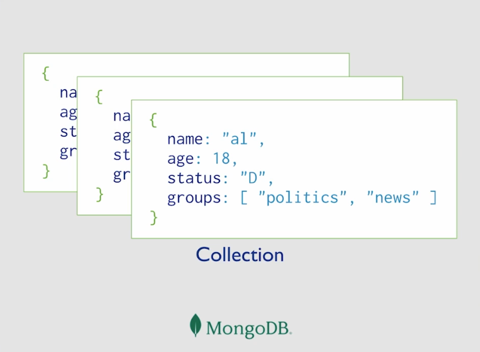
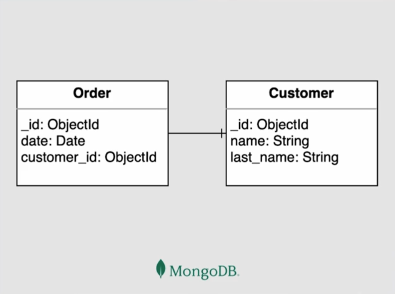
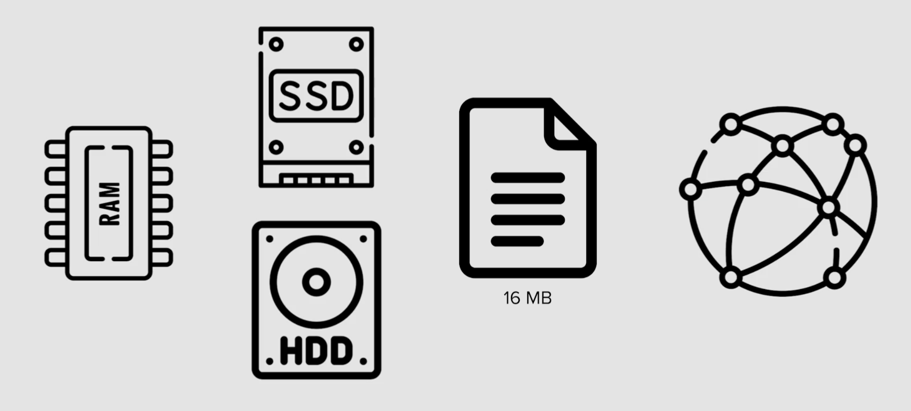
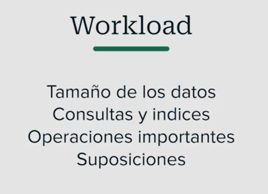
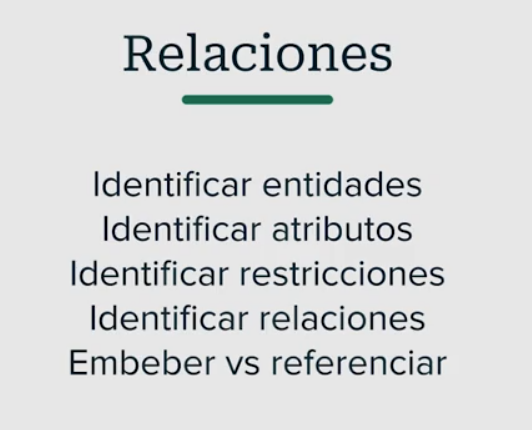
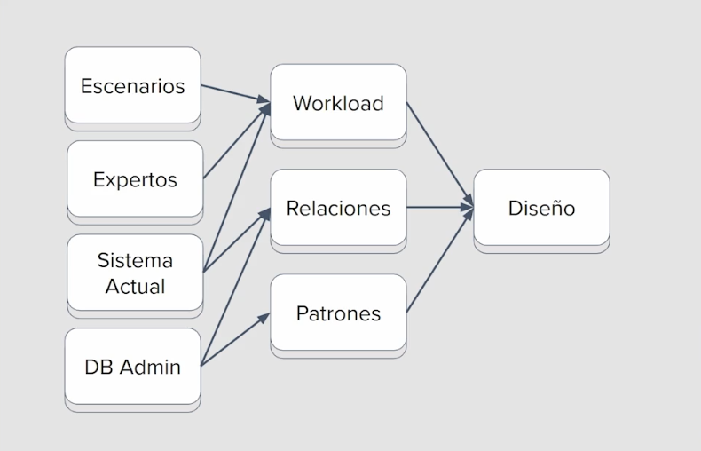

## 🧠 Introducción a MongoDB: Explorando el mundo de las bases de datos NoSQL

En el universo del desarrollo moderno, los datos ya no se almacenan únicamente en tablas rígidas y relaciones complejas. Hoy exploraremos **MongoDB**, una base de datos **NoSQL** que rompe con los esquemas tradicionales y nos invita a pensar en estructuras más flexibles, escalables y adaptadas a la realidad de las aplicaciones web actuales.

MongoDB no usa filas ni columnas. En su lugar, trabaja con **documentos JSON**, lo que permite modelar la información de forma más natural, como si estuviéramos organizando objetos en JavaScript. Esto lo convierte en una herramienta ideal para proyectos dinámicos, desde redes sociales hasta sistemas de videovigilancia y plataformas educativas.

### 🧩 ¿Por qué aprender MongoDB?
- 📦 Porque permite almacenar datos de forma **modular y escalable**.
- 🚀 Porque se integra fácilmente con tecnologías modernas como Node.js, Express y React.
- 🔐 Porque ofrece herramientas robustas de **seguridad, autenticación y replicación**.
- 🧑‍🏫 Porque como futuros desarrolladores, necesitamos dominar tanto el enfoque relacional como el no relacional.

---

Los beneficios que se pueden obtener son:

* Buen rendimiento

* Productividad en desarrollo → Al tener una buena arquitectura y un buen modelado nos permite como desarrolladores hacer consultas mas simples y mucho mas eficientes.

* Minimizar costos → Un buen modelado nos permite minimizar costos, por ejemplo, en operaciones de lectura y escritura.

MongoDB es categorizada como una base de datos NoSQL y en base a documentos, convirtiéndose así en una base de datos muy poderosa y flexible. Pero por ser flexible no significa que no tenga una estructura, ya que al igual que otras bases de datos existen patrones y estructuras que nos ayudan a modelar nuestros datos.

Otra característica muy especial de MongoDB es que podemos desarrollar nuestro modelo de datos de forma iterativa, esto quiere decir, que si nuestra aplicación va creciendo a nivel de características y funcionalidades paralelamente podemos ir iterando nuestro modelado de datos sin perjudicar al negocio.

La flexibilidad de Mongo nos permite hacer esto de forma dinámica haciendo uso de unos determinados patrones, mientras que otro tipo de base de datos como lo son las relacionales o tabulares tendríamos que correr todo un proceso de migraciones si deseamos modificar a nivel de estructura nuestra base de datos.

Mongo forma parte de la familia de bases de datos documentales y se ha posicionado como una herramienta clave en el ámbito del almacenamiento y gestión de datos. La principal característica de Mongo es su capacidad para organizar la información de manera legible a través de JSON, un estándar que permite representar datos en pares clave-valor, haciendo que sea natural trabajar con documentos estructurados. Aunque internamente usa BSON, un formato binario optimizado para eficiencia, todas las interacciones externas se realizan mediante JSON, facilitando la lectura y manipulación de datos.

Mongo no solo destaca por su estructura de datos innovadora, sino también por cómo se almacenan los documentos en colecciones. Esto permite agrupar datos relacionados de manera intuitiva.

Por ejemplo, una "colección de usuarios" almacenaría los perfiles de los usuarios, mientras que una "colección de productos" contendría los detalles relevantes de cada producto.

### Diagrama Entidad Relación (ER)

El diagrama entidad-relación (ERD, por sus siglas en inglés) es una herramienta esencial para modelar, visualizar y comprender cómo se interrelacionan los datos en una base de datos. Al utilizar este tipo de diagramas, se identifican claramente las entidades, atributos y las conexiones entre ellas. Esto se representa con cajas donde se listan los detalles de cada entidad con sus respectivos tipos de datos como ObjectId, fechas o strings.

También lo podemos representar de la siguiente manera:

### Tipos de relaciones en el ERD

Las líneas que conectan las entidades en el diagrama representan las relaciones.

Estas relaciones pueden ser de:

- **Uno a uno**: una única entidad está asociada con otra única entidad.
- **Uno a muchos**: una entidad puede vincularse a múltiples entidades.
- **Muchos a muchos**: múltiples entidades de ambos lados están relacionadas entre sí.

MongoDB propone ajustes a estos diagramas para adaptarse mejor a las bases de datos no relacionales.

### ¿Qué metodologías elegir para un buen modelado en Mongo?

El modelado adecuado de los datos es crucial para maximizar el desempeño y la efectividad de una base de datos. Existen diversas metodologías que ayudan a conceptualizar y estructurar mejor los datos en Mongo. Es importante conocer:

1. **Denormalización frente a normalización**: Aunque la normalización es esencial para eliminar redundancias, Mongo a menudo se beneficia de la denormalización al almacenar duplicados de datos para mejorar el tiempo de respuesta.

2. **Uso eficiente de subdocumentos y arrays**: Si bien los subdocumentos ofrecen una estructura interna rica dentro de un solo documento, su uso debe ser optimizado para no aumentar el tamaño del documento más de lo necesario.

3. **Elección adecuada de índices**: El uso estratégico de índices puede mejorar significativamente las velocidades de búsqueda y consulta, pero también hay que ser conscientes de los recursos que estos consumen.

A medida que avanzamos, veremos cómo cada metodología se adapta a diferentes necesidades y cómo seleccionar la más adecuada para cada caso particular.

### ¿Por qué es crucial seguir una metodología de modelamiento de datos?

Para obtener un modelamiento de datos efectivo, es indispensable seguir una metodología bien estructurada. Esta aborda patrones y arquitectura tanto para bases de datos relacionales como NoSQL. La importancia de estas estrategias radica en adaptarse a restricciones de sistemas, optimizando recursos y rendimiento.

### ¿Cuáles son las restricciones comunes en los sistemas de datos?

Las restricciones en un sistema son fundamentales al modelar datos. Se presentan limitaciones tales como:

- **Recursos de hardware**: Como el espacio en la RAM, discos de estado sólido o discos mecánicos. Por ejemplo, información histórica puede almacenarse en discos mecánicos, mientras que datos de consulta rápida deberían estar en discos de estado sólido o directamente en la memoria RAM.

- **Tamaño de documentos**: En MongoDB, los documentos tienen un límite de 16 MB.

- **Latencia**: Influye en dónde se almacena la base de datos para minimizar el tiempo de espera de los usuarios, utilizando redes de entrega de contenido (CDN).

### ¿Cómo afecta la latencia al acceso de datos?

La latencia es el tiempo que tarda una solicitud en llegar al servidor y regresar con una respuesta. Puede ser crucial en la experiencia del usuario, ya que la ubicación del servidor respecto al usuario afecta este tiempo. Por eso, aplicaciones como MongoATLAS ofrecen configuraciones de réplicas geográficas para disminuir la latencia.

**¿Qué fases componen la metodología de modelamiento?**

El modelamiento se divide en tres fases esenciales: escenarios, relaciones y patrones.

## ¿Cómo identificar los escenarios adecuados?

Primero, es esencial definir el escenario en el que operará el modelo de negocio. Un correcto reconocimiento de los contextos y reglas de negocio es crucial. Por ejemplo, en un e-commerce, es importante comprender cómo los usuarios interactúan con un carrito de compras. En un proyecto de IoT, el manejo y registro de los sensores difiere completamente.

### ¿Por qué son relevantes los expertos en el tema?

Los expertos en el tema son críticos para entender a fondo el negocio. Ya sea un especialista en e-commerce o en el clima, su conocimiento detallado es esencial. Adicionalmente, familiarizarse con el sistema actual, incluso si solo son hojas de cálculo, permite una mejor adaptación y optimización del nuevo diseño de base de datos.

### ¿Qué es el "workload" y cómo se construye?

El "workload" o carga de trabajo es un documento que se genera a partir de la interacción de expertos en la materia, los escenarios definidos y el sistema actual. Aquí se identifican relaciones y operaciones comunes, facilitando un modelo de datos óptimo.

**¿Cuáles son los pasos finales en el modelamiento de datos?**

Una vez definidos los escenarios y construida la carga de trabajo, queda considerar las relaciones y seguir los patrones adecuados para garantizar un sistema eficiente.

### ¿Cómo determinar las relaciones adecuadas entre datos?

Las relaciones se basan en las restricciones identificadas por el experto en modelado. Es vital definir entidades y atributos, además de decidir si se referencian o se embeben las relaciones en bases de datos NoSQL.

### ¿Cuán importante es aplicar patrones en el modelamiento?

Los patrones son útiles para mejorar el rendimiento y adecuar el sistema a necesidades específicas. Aunque son opcionales, aplicarlos puede llevar a bases de datos más rápidas y eficaces.

### ¿Qué resultado final se busca al aplicar esta metodología?

El resultado es un diseño de bases de datos estructurado que optimiza rendimiento, escalabilidad y costo. Esto asegura que la aplicación funcione de manera eficiente y se adapte a las necesidades futuras del negocio.

#### Workload: [documento workload](./06-Workload.md)
