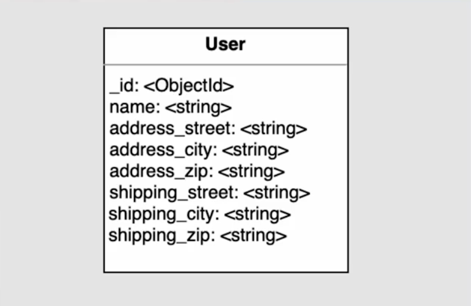
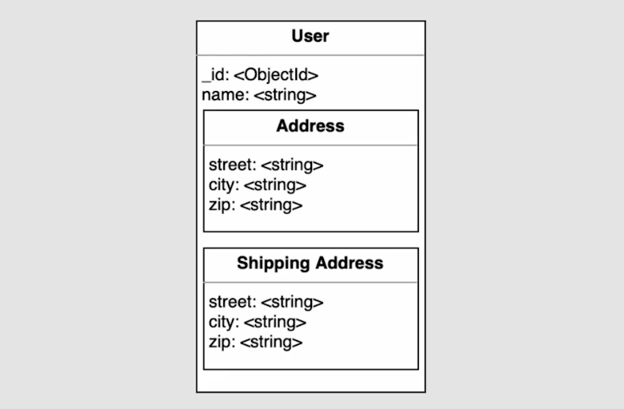
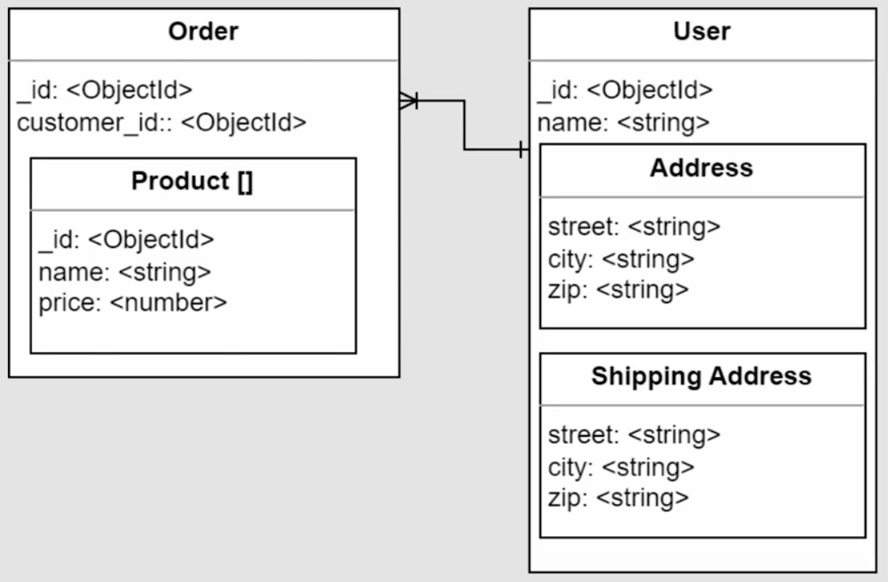

# 📘 Relaciones 1 a 1 Embebidas en Bases de Datos NoSQL

## 🧠 ¿Qué son y para qué sirven?

Las relaciones 1 a 1 embebidas permiten **agrupar información relacionada dentro de un mismo documento**, lo que mejora la coherencia y simplifica las consultas. Son especialmente útiles cuando los datos se consultan juntos con frecuencia.

Ejemplo Documento User.



Documento User con los campos address y shipping address embebidas.



> 🛒 Ejemplo típico: En un sistema de e-commerce, un usuario puede tener dos direcciones (residencial y de envío). En lugar de crear colecciones separadas, se embeben como subdocumentos dentro del documento del usuario.

## 🧱 Estructura de Subdocumentos

```json
{
  "nombre": "Juan",
  "email": "juan@example.com",
  "address": {
    "calle": "Carrera 87",
    "ciudad": "Bogotá",
    "zip": "111111"
  },
  "shipping_address": {
    "calle": "Avenida Siempre Viva",
    "ciudad": "Bogotá",
    "zip": "222222"
  }
}
```

🔍 Aquí, `address` y `shipping_address` son subdocumentos embebidos. Esto permite mantener la información agrupada y facilita su acceso.

## 🔎 Consultas sobre Subdocumentos

Puedes realizar búsquedas directamente sobre los atributos internos:

```js
db.users.find({ "address.ciudad": "Bogotá" })
```

✅ Esto devuelve todos los usuarios cuya dirección residencial está en Bogotá, sin necesidad de hacer joins o consultar múltiples colecciones.

## ✅ ¿Cuándo usar relaciones embebidas?

Usa este enfoque cuando:

- **Los datos se consultan juntos**: Si siempre necesitas la dirección al consultar el usuario.
- **Existe dependencia directa**: La dirección no tiene sentido sin el usuario.
- **Deseas simplificar el modelo**: Evitas referencias innecesarias y reduces la complejidad.

📊 Se estima que el 90% de las relaciones 1 a 1 se benefician de este enfoque.

## ⚠️ ¿Cuándo evitarlo?

Evita embeber si:

- El subdocumento tiene **significado propio** o se reutiliza en otros contextos.
- Necesitas **consultarlo de forma independiente** o compartirlo entre varios documentos.

📌 Ejemplo: En un sistema de inventario o e-commerce, múltiples productos pueden pertenecer a una misma categoría.

# 🔗 Relaciones 1 a 1 Referenciadas en MongoDB

## 🧠 ¿Qué son y cuándo se usan?

Las relaciones 1 a 1 referenciadas se utilizan cuando **no es viable embeber la información** directamente en un documento, ya sea por limitaciones técnicas o por necesidades de rendimiento.

### ⚠️ Casos típicos donde se recomienda referenciar:

- **📦 Tamaño máximo de documento (16MB)**: Si el subdocumento contiene imágenes, videos o binarios pesados.
- **🐢 Consultas lentas**: Cuando se procesan datos innecesarios en cada petición.
- **🚀 Optimización de rendimiento**: Si se requiere consultar grandes volúmenes de datos rápidamente, dejando los detalles aparte.

## 🧱 Ejemplo de estructura referenciada

```js
// Documento principal: tienda
db.stores.insertOne({
    storeId: "ST001",
    name: "PamplonaStore",
    address: "Calle falsa 123",
    city: "Sprinfield",
    state: "Londres",
    zip: "1234"
})

// Documento relacionado: detalles de tienda
db.stores_details.insertOne({
    storeId: "ST001", // clave compartida para la relación
    description: "PamplonaStore asdasdasd",
    services: ["Ropa", "Deportivo"],
    manager: {
        name: "Mario",
        cellphone: "123412412"
    }
})
```

🔗 Ambos documentos están relacionados por el campo `storeId`, pero viven en colecciones separadas.

## 🔍 Consultas por separado

```js
db.stores.findOne({ storeId: "ST001" }) // tienda
db.stores_details.findOne({ storeId: "ST001" }) // detalles
```

✅ Esto permite consultar solo lo necesario, sin cargar datos pesados o irrelevantes.

## 🔄 Consulta conjunta con `$lookup`

Para unir los datos de ambas colecciones:

```js
db.stores.aggregate([
  {
    $lookup: {
      from: 'stores_details', // agregamos cual coleccion queremos conectar
      localField: 'storeId', // que campo los enlaza, en stores
      foreignField: 'storeId', // que campo los enlaza, en stores_details
      as: 'detail' // donde dejara la relacion
    }
  }
])
```

📦 Resultado:

```json
{
  "storeId": "ST001",
  "name": "PamplonaStore",
  "detail": [
    {
      "description": "PamplonaStore asdasdasd",
      "services": ["Ropa", "Deportivo"],
      "manager": { "name": "Mario", "cellphone": "123412412" }
    }
  ]
}
```

## ⚠️ Consideraciones técnicas

- Si los campos no coinciden o están ausentes, `$lookup` puede devolver **datos inesperados o nulos**.
- MongoDB puede generar **matrices vacías o 2D** si hay inconsistencias en los campos relacionados.
- Es importante validar que los campos clave (`storeId`) estén presentes y correctamente indexados.

# 📚 Relaciones Uno a Muchos Embebidas en MongoDB

## 🧠 ¿Qué significa una relación uno a muchos embebida?

En bases de datos NoSQL como MongoDB, una relación uno a muchos embebida se utiliza cuando **un documento principal contiene múltiples elementos relacionados**, almacenados como un array. Es ideal cuando esos datos se consultan juntos y tienen una dependencia lógica fuerte.

> 🛒 Ejemplo típico: Un usuario con múltiples órdenes de compra, donde cada orden contiene varios productos.



## 🧱 ¿Qué significa “embebido”?

Embebido significa que los datos relacionados **se almacenan dentro del mismo documento**, en lugar de en colecciones separadas. Se representa como un array (`[]`) de subdocumentos.

### 🔧 Ejemplo en código

```js
db.order.insertOne({
  userID: ObjectId("..."),
  date: "2023-11-05",
  items: [
    {
      product: "Camiseta",
      price: 120,
      quantity: 1
    },
    {
      product: "Pantalón",
      price: 200,
      quantity: 2
    }
  ]
})
```

✅ Aquí, el array `items` representa una relación uno a muchos embebida: una orden con varios productos.

## 🚀 Ventajas de usar relaciones embebidas

- **Consultas rápidas**: Toda la información está en un solo documento.
- **Consistencia de datos**: Se reduce el riesgo de desincronización.
- **Eficiencia**: Ideal para datos que se consultan como un conjunto lógico (como los capítulos de un libro o los ítems de una orden).

## 📌 ¿Cuándo es recomendable?

Usa relaciones embebidas cuando:

- Hay **dependencia intrínseca**: Los datos embebidos no tienen sentido por sí solos.
- La relación es **uno a pocos**: El número de elementos es limitado y no crecerá indefinidamente.
- Se requiere **consultar todo junto**: Por ejemplo, mostrar una orden completa con todos sus ítems.

## ⚠️ ¿Cuándo evitarlo?

Evita embeber si:

- El volumen de datos puede **crecer sin control** (como comentarios en un producto).
- Los elementos embebidos deben ser **consultados o modificados individualmente** con frecuencia.
- Existe riesgo de **superar el límite de 16MB** por documento en MongoDB.


>Pipeline => Permite omitir campos del otro documento que no quiero traer, es de buen uso cuando por ejemplo quiero traer una order y usuario, pero por seguridad no retornar el password del usuario.

```js
db.inventory2.aggregate([
  {
      $match: ObjectId('12e21j321321') 
  },
  {
      $lookup: {
          pipeline: [
              {$project: {identification_number: 0, password: 0, createdAt: 0, updatedAt: 0, token: 0}},
          ],
          from :'inventory1',
          localField: 'iduser',
          foreignField: 'iduser',
          as: 'detail'
      }
  },
  {
      $unwind: '$detail'
  }
])
```
