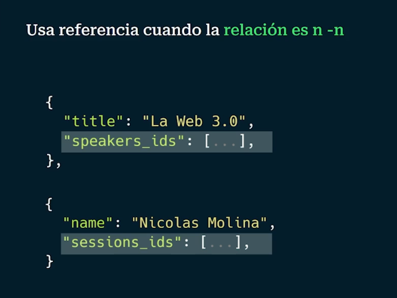
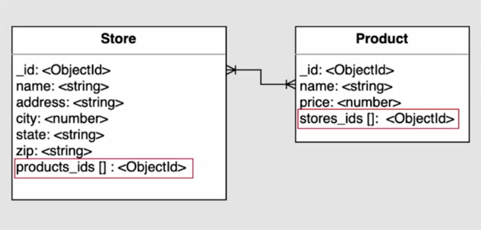
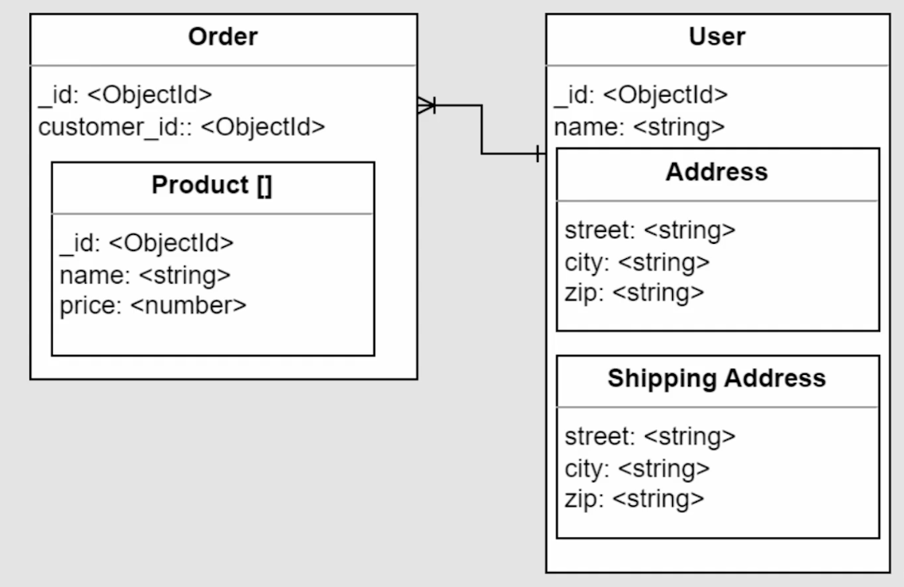
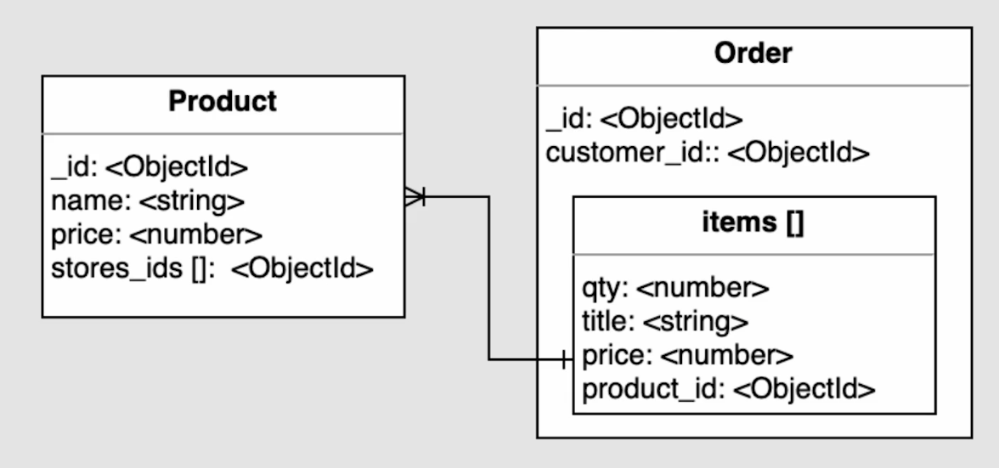

# 📘 Relaciones 1 a 1 Embebidas en Bases de Datos NoSQL

## 🧠 ¿Qué son y para qué sirven?

Las relaciones 1 a 1 embebidas permiten **agrupar información relacionada dentro de un mismo documento**, lo que mejora la coherencia y simplifica las consultas. Son especialmente útiles cuando los datos se consultan juntos con frecuencia.

Ejemplo Documento User.


Documento User con los campos address y shipping address embebidas.


> 🛒 Ejemplo típico: En un sistema de e-commerce, un usuario puede tener dos direcciones (residencial y de envío). En lugar de crear colecciones separadas, se embeben como subdocumentos dentro del documento del usuario.

## 🧱 Estructura de Subdocumentos

```json
{
  "nombre": "Juan",
  "email": "juan@example.com",
  "address": {
    "calle": "Carrera 87",
    "ciudad": "Bogotá",
    "zip": "111111"
  },
  "shipping_address": {
    "calle": "Avenida Siempre Viva",
    "ciudad": "Bogotá",
    "zip": "222222"
  }
}
```

🔍 Aquí, `address` y `shipping_address` son subdocumentos embebidos. Esto permite mantener la información agrupada y facilita su acceso.

## 🔎 Consultas sobre Subdocumentos

Puedes realizar búsquedas directamente sobre los atributos internos:

```js
db.users.find({ "address.ciudad": "Bogotá" })
```

✅ Esto devuelve todos los usuarios cuya dirección residencial está en Bogotá, sin necesidad de hacer joins o consultar múltiples colecciones.

## ✅ ¿Cuándo usar relaciones embebidas?

Usa este enfoque cuando:

- **Los datos se consultan juntos**: Si siempre necesitas la dirección al consultar el usuario.
- **Existe dependencia directa**: La dirección no tiene sentido sin el usuario.
- **Deseas simplificar el modelo**: Evitas referencias innecesarias y reduces la complejidad.

📊 Se estima que el 90% de las relaciones 1 a 1 se benefician de este enfoque.

## ⚠️ ¿Cuándo evitarlo?

Evita embeber si:

- El subdocumento tiene **significado propio** o se reutiliza en otros contextos.
- Necesitas **consultarlo de forma independiente** o compartirlo entre varios documentos.

📌 Ejemplo: En un sistema de inventario o e-commerce, múltiples productos pueden pertenecer a una misma categoría.

---

# 🔗 Relaciones 1 a 1 Referenciadas en MongoDB

## 🧠 ¿Qué son y cuándo se usan?

Las relaciones 1 a 1 referenciadas se utilizan cuando **no es viable embeber la información** directamente en un documento, ya sea por limitaciones técnicas o por necesidades de rendimiento.

### ⚠️ Casos típicos donde se recomienda referenciar:

- **📦 Tamaño máximo de documento (16MB)**: Si el subdocumento contiene imágenes, videos o binarios pesados.
- **🐢 Consultas lentas**: Cuando se procesan datos innecesarios en cada petición.
- **🚀 Optimización de rendimiento**: Si se requiere consultar grandes volúmenes de datos rápidamente, dejando los detalles aparte.

## 🧱 Ejemplo de estructura referenciada

```js
// Documento principal: tienda
db.stores.insertOne({
    storeId: "ST001",
    name: "PamplonaStore",
    address: "Calle falsa 123",
    city: "Sprinfield",
    state: "Londres",
    zip: "1234"
})

// Documento relacionado: detalles de tienda
db.stores_details.insertOne({
    storeId: "ST001", // clave compartida para la relación
    description: "PamplonaStore asdasdasd",
    services: ["Ropa", "Deportivo"],
    manager: {
        name: "Mario",
        cellphone: "123412412"
    }
})
```

🔗 Ambos documentos están relacionados por el campo `storeId`, pero viven en colecciones separadas.

## 🔍 Consultas por separado

```js
db.stores.findOne({ storeId: "ST001" }) // tienda
db.stores_details.findOne({ storeId: "ST001" }) // detalles
```

✅ Esto permite consultar solo lo necesario, sin cargar datos pesados o irrelevantes.

## 🔄 Consulta conjunta con `$lookup`

Para unir los datos de ambas colecciones:

```js
db.stores.aggregate([
  {
    $lookup: {
      from: 'stores_details', // agregamos cual coleccion queremos conectar
      localField: 'storeId', // que campo los enlaza, en stores
      foreignField: 'storeId', // que campo los enlaza, en stores_details
      as: 'detail' // donde dejara la relacion
    }
  }
])
```

📦 Resultado:

```json
{
  "storeId": "ST001",
  "name": "PamplonaStore",
  "detail": [
    {
      "description": "PamplonaStore asdasdasd",
      "services": ["Ropa", "Deportivo"],
      "manager": { "name": "Mario", "cellphone": "123412412" }
    }
  ]
}
```

## ⚠️ Consideraciones técnicas

- Si los campos no coinciden o están ausentes, `$lookup` puede devolver **datos inesperados o nulos**.
- MongoDB puede generar **matrices vacías o 2D** si hay inconsistencias en los campos relacionados.
- Es importante validar que los campos clave (`storeId`) estén presentes y correctamente indexados.

---

# 📚 Relaciones Uno a Muchos Embebidas en MongoDB

## 🧠 ¿Qué significa una relación uno a muchos embebida?

En bases de datos NoSQL como MongoDB, una relación uno a muchos embebida se utiliza cuando **un documento principal contiene múltiples elementos relacionados**, almacenados como un array. Es ideal cuando esos datos se consultan juntos y tienen una dependencia lógica fuerte.

> 🛒 Ejemplo típico: Un usuario con múltiples órdenes de compra, donde cada orden contiene varios productos.


## 🧱 ¿Qué significa “embebido”?

Embebido significa que los datos relacionados **se almacenan dentro del mismo documento**, en lugar de en colecciones separadas. Se representa como un array (`[]`) de subdocumentos.

### 🔧 Ejemplo en código

```js
db.order.insertOne({
  userID: ObjectId("..."),
  date: "2023-11-05",
  items: [
    {
      product: "Camiseta",
      price: 120,
      quantity: 1
    },
    {
      product: "Pantalón",
      price: 200,
      quantity: 2
    }
  ]
})
```

✅ Aquí, el array `items` representa una relación uno a muchos embebida: una orden con varios productos.

## 🚀 Ventajas de usar relaciones embebidas

- **Consultas rápidas**: Toda la información está en un solo documento.
- **Consistencia de datos**: Se reduce el riesgo de desincronización.
- **Eficiencia**: Ideal para datos que se consultan como un conjunto lógico (como los capítulos de un libro o los ítems de una orden).

## 📌 ¿Cuándo es recomendable?

Usa relaciones embebidas cuando:

- Hay **dependencia intrínseca**: Los datos embebidos no tienen sentido por sí solos.
- La relación es **uno a pocos**: El número de elementos es limitado y no crecerá indefinidamente.
- Se requiere **consultar todo junto**: Por ejemplo, mostrar una orden completa con todos sus ítems.

## ⚠️ ¿Cuándo evitarlo?

Evita embeber si:

- El volumen de datos puede **crecer sin control** (como comentarios en un producto).
- Los elementos embebidos deben ser **consultados o modificados individualmente** con frecuencia.
- Existe riesgo de **superar el límite de 16MB** por documento en MongoDB.


>Pipeline => Permite omitir campos del otro documento que no quiero traer, es de buen uso cuando por ejemplo quiero traer una order y usuario, pero por seguridad no retornar el password del usuario.

```js
db.inventory2.aggregate([
  {
      $match: ObjectId('12e21j321321') 
  },
  {
      $lookup: {
          pipeline: [
              {$project: {identification_number: 0, password: 0, createdAt: 0, updatedAt: 0, token: 0}},
          ],
          from :'inventory1',
          localField: 'iduser',
          foreignField: 'iduser',
          as: 'detail'
      }
  },
  {
      $unwind: '$detail'
  }
])
```

---

# 🔗 Relaciones Uno a Muchos Referenciadas en MongoDB

## 🧠 ¿Qué son?

Una relación uno a muchos referenciada ocurre cuando **un documento principal está vinculado a múltiples documentos secundarios**, pero cada uno vive en su propia colección. Es útil cuando los datos secundarios tienen independencia o pueden crecer significativamente.

> 🛒 Ejemplo clásico: Un usuario con varias órdenes de compra. Cada orden pertenece a un único usuario, pero se almacena en una colección separada.

## 🧱 ¿Cómo se expresa en MongoDB?

Se utiliza una **clave de referencia** (como `userID`) para conectar documentos entre colecciones.

### 🔧 Ejemplo en código

```js
// Documento en la colección de órdenes
{
  userID: ObjectId("507f1f77bcf86cd799439011"),
  product: "Zapatos",
  quantity: 1,
  price: 90
}
```

✅ Aquí, `userID` referencia al documento del usuario en la colección `users`.

## 🔍 Consultas efectivas

### 🔸 Consulta simple

```js
db.orders.find({ userID: ObjectId("507f1f77bcf86cd799439011") })
```

🔎 Devuelve todas las órdenes asociadas al usuario especificado.

### 🔸 Consulta con `$lookup`

Para obtener los datos del usuario junto con sus órdenes:

```js
db.orders.aggregate([
  {
    $lookup: {
      from: "users",
      localField: "userID",
      foreignField: "_id",
      as: "userDetails"
    }
  }
])
```

📦 Resultado: Cada orden incluirá un array `userDetails` con la información del usuario.

## ✅ ¿Cuándo conviene usar referencias?

Usa referencias cuando:

- **📈 Los datos secundarios pueden crecer mucho** (como comentarios, logs, transacciones).
- **🔁 Se actualizan frecuentemente** (como direcciones o perfiles).
- **🔄 Se reutilizan en varios documentos** (como categorías, etiquetas, autores).

## ⚠️ Consideraciones

- Las referencias requieren **consultas adicionales o agregaciones** para unir datos.
- Es importante **indexar correctamente** los campos referenciados para mantener el rendimiento.
- Evita referenciar si los datos son pequeños, dependientes y siempre se consultan juntos.

---

# 🔄 Relaciones Muchos a Muchos Referenciadas en MongoDB

## 🧠 ¿Qué son?

Las relaciones muchos a muchos permiten conectar **varios elementos de una colección con varios elementos de otra**. Son esenciales para modelar escenarios complejos y realistas.

> 🛍️ Ejemplo clásico: Una tienda puede vender múltiples productos, y un producto puede estar disponible en varias tiendas.

## 🔗 ¿Por qué usar referencias?

Las relaciones muchos a muchos **no deben embebirse**, ya que:

- Limitan la flexibilidad.
- Impiden que ambas entidades se refieran mutuamente.
- Generan redundancia y dificultan actualizaciones.

✅ Lo ideal es usar **referencias mediante ObjectId** para vincular documentos entre colecciones.

## 🧱 Ejemplo práctico: Tiendas y productos

### 1️⃣ Insertar productos

```json
[
  { "nombre": "Producto 1", "tamaño": ["L", "M"], "precio": 30 },
  { "nombre": "Producto 2", "tamaño": ["L"], "precio": 45 },
  { "nombre": "Producto 3", "tamaño": ["M"], "precio": 90 }
]
```

📦 Cada producto tiene propiedades como nombre, tallas disponibles y precio.

### 2️⃣ Relacionar tiendas con productos

```json
[
  {
    "nombre": "Store1",
    "productsIDs": [
      ObjectId("5f50c31aa06a6b3f79138c49"),
      ObjectId("5f50c31aa06a6b3f79138c50")
    ]
  },
  {
    "nombre": "Store2",
    "productsIDs": [
      ObjectId("5f50c31aa06a6b3f79138c51"),
      ObjectId("5f50c31aa06a6b3f79138c52")
    ]
  }
]
```

🔗 Aquí, cada tienda contiene un array de referencias a productos.

## 🔍 Consultas enriquecidas con `$lookup`

Para unir tiendas con sus productos:

```js
db.stores.aggregate([
  {
    $lookup: {
      from: "products",
      localField: "productsIDs",
      foreignField: "_id",
      as: "productos"
    }
  }
])
```

📊 Resultado: Cada tienda incluirá un array `productos` con los detalles completos de cada producto.

## 🎯 Escenarios reales

### 🎤 Conferencias y speakers

- Un **speaker** puede participar en varias **sesiones**.
- Una **sesión** puede tener varios **speakers**.

🔁 Ambas entidades se refieren mutuamente, lo que requiere una relación muchos a muchos referenciada.

## ✅ Ventajas del enfoque referenciado

- **Escalabilidad**: Ideal para grandes volúmenes de datos.
- **Reutilización**: Evita duplicar información.
- **Actualización eficiente**: Cambios en un documento se reflejan en todos los relacionados.



---

# 🔁 Relaciones Muchos a Muchos con Referencias Bidireccionales en MongoDB

## 🧠 ¿Qué son?

Las relaciones muchos a muchos permiten que **varios documentos de una colección se vinculen con varios documentos de otra**. Cuando ambos lados mantienen referencias entre sí, hablamos de una **relación bidireccional**.

> 🛍️ Ejemplo: Un producto puede estar disponible en varias tiendas, y una tienda puede vender múltiples productos. Ambos documentos se refieren mutuamente.



## 🔧 ¿Cómo actualizar un producto para incluir tiendas?

Para reflejar esta relación desde el lado del producto:

### 1️⃣ Identificar los IDs

- Consulta el producto que deseas actualizar.
- Obtén el `_id` de las tiendas que quieres vincular.

### 2️⃣ Actualizar el documento

```js
db.productos.updateOne(
  { _id: ObjectId("ID_del_producto") },
  {
    $set: {
      StoreIDs: [
        ObjectId("ID_tienda_1"),
        ObjectId("ID_tienda_2")
      ]
    }
  }
)
```

✅ Esto añade el campo `StoreIDs` al producto, con una lista de tiendas asociadas.

## 🔍 ¿Cómo verificar la relación?

### 🔸 Consulta directa

```js
db.productos.findOne({ _id: ObjectId("ID_del_producto") })
```

🔎 Verifica que el campo `StoreIDs` contenga los IDs esperados.

### 🔸 Consulta enriquecida con `$lookup`

```js
db.productos.aggregate([
  {
    $lookup: {
      from: "stores",
      localField: "StoreIDs",
      foreignField: "_id",
      as: "DetalleStores"
    }
  }
])
```

📦 Resultado: El producto incluirá un array `DetalleStores` con los datos completos de cada tienda.

## 🔄 ¿Desde el lado de la tienda también?

Sí. Para una relación verdaderamente bidireccional, cada tienda también debe tener un array `productIDs` con los productos que ofrece.

Esto permite:

- Consultar desde **productos hacia tiendas**.
- Consultar desde **tiendas hacia productos**.

## ✅ ¿Cuándo usar referencias bidireccionales?

Usa este enfoque cuando:

- La información se consulta **frecuentemente desde ambos lados**.
- Se requiere **navegación cruzada** en la aplicación (ej. ver productos por tienda y tiendas por producto).
- Se busca **optimizar la experiencia del usuario** con vistas completas.

## ⚠️ ¿Y si solo se consulta desde un lado?

En ese caso, puedes usar **referencias unilaterales**. Por ejemplo:

- Si solo necesitas saber qué productos tiene una tienda, pero no desde el producto hacia la tienda.
- Esto reduce redundancia y simplifica el modelo.

---

# 🧩 Desnormalización en Bases de Datos Documentales (MongoDB)

## 🧠 ¿Qué es la desnormalización?

La desnormalización consiste en **duplicar ciertos datos dentro de un documento** para evitar consultas adicionales y mejorar el rendimiento. Aunque contradice los principios de normalización en bases relacionales (como PostgreSQL o MySQL), en MongoDB puede ser una estrategia muy eficiente.

> 🔄 En lugar de evitar la redundancia, se **acepta y controla** para acelerar el acceso a la información.






## 🛒 Ejemplo práctico: Órdenes de compra en un e-commerce

### 🔧 Estructura desnormalizada

```js
const order = {
  items: [
    {
      productId: "12345",
      title: "Product 1",
      price: 12,
      quantity: 2
    },
    {
      productId: "67890",
      title: "Product 2",
      price: 45,
      quantity: 1
    }
  ],
  userId: "user123"
};
```

✅ Aquí, cada ítem incluye el `productId`, pero también **replica el título y precio** del producto. Esto evita tener que consultar la colección `products` para generar una factura o mostrar el historial de compras.

## 🎯 Ventajas de la desnormalización

1. **🚀 Consultas más rápidas**: No necesitas hacer `$lookup` ni múltiples llamadas para obtener datos clave.
2. **📜 Registro histórico**: Conservas el precio y detalles del producto **tal como estaban al momento de la compra**, incluso si luego cambian.

## 🔍 Verificación en MongoDB

```js
db.orders.find({ _id: ObjectId("orderId") })
```

🔎 Esta consulta permite revisar cómo quedó estructurada la orden y confirmar que los datos desnormalizados están presentes.

## ⚙️ ¿Cómo afecta la estructura de tu base?

- Requiere **automatizar el proceso** desde tu aplicación o servicio web.
- Debes definir reglas claras para **cuándo y qué datos duplicar**.
- Implica **mantener coherencia** entre datos originales y duplicados si se actualizan.
