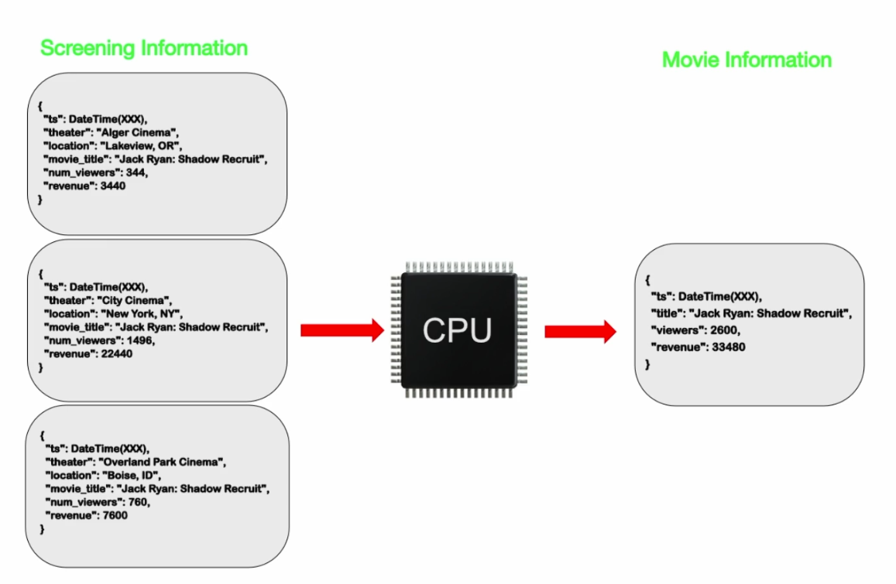
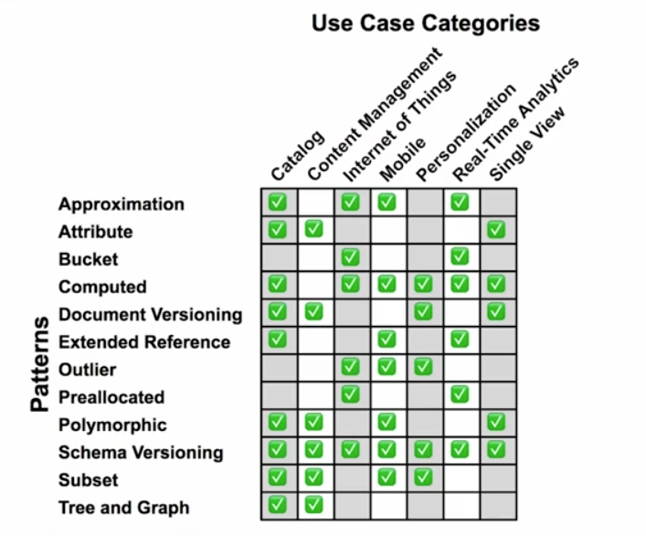

# 🧮 Patrón Computed Pattern en MongoDB

## 🧠 ¿Qué es?

El **Computed Pattern** consiste en **precalcular valores** (como totales o promedios) en el momento de la escritura, para evitar cálculos costosos durante las consultas de lectura.

> 🔄 En lugar de calcular el total de una orden cada vez que se consulta, se actualiza automáticamente al agregar ítems.

## 🛒 Ejemplo práctico: Órdenes de compra en un e-commerce

### 🔧 Estructura inicial

Al crear una orden, se incluye:

- El usuario que la genera.
- La fecha de creación.
- Un array vacío de ítems.

Este modelo simula un **carrito de compras dinámico**, donde los productos se agregan gradualmente.

### ➕ Agregar ítems y actualizar el total

```js
db.orders.updateOne(
  { _id: ObjectId("orden_id") },
  {
    $push: {
      items: {
        producto: "producto1",
        precio: 12,
        cantidad: 1
      }
    },
    $inc: { total: 12 } // precio * cantidad
  }
)
```

✅ Se usa `$push` para añadir el ítem y `$inc` para actualizar el total precalculado.

## 🚀 Ventajas del patrón

- **Consultas más rápidas**: El total ya está disponible, sin necesidad de recorrer el array.
- **Menor carga de CPU**: Evita cálculos en tiempo real.
- **Historial confiable**: Conserva el valor exacto al momento de la operación.

## 🎯 ¿Cuándo aplicarlo?

Este patrón es ideal cuando:

- Las **lecturas son más frecuentes** que las escrituras.
- Se requiere **respuesta rápida** en interfaces de usuario.
- Se manejan **grandes volúmenes de datos**.

## 📚 Casos de uso

### 📝 Sistema educativo

En un examen nacional, el puntaje total se calcula al finalizar el examen. Así, las listas de resultados se generan rápidamente sin recalcular.

### 🎬 Industria del entretenimiento

Cada sesión de una película genera ingresos. Al finalizar, se suma al total de la película, evitando sumar manualmente en cada consulta.




## 🛠️ Consejos para implementarlo

1. **Analiza las frecuencias**: ¿Se consulta más de lo que se actualiza?
2. **Define reglas claras**: Implementa la lógica en el backend (Python, JS, .NET, etc.).
3. **Piensa en escalabilidad**: Este patrón reduce la carga en sistemas con muchos usuarios o transacciones.


