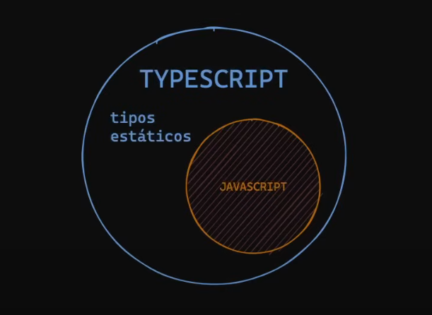

# Curso Typescript

TypeScript es JavaScript con una sintaxis para tipos.



Éste **superset** de **TypeScript** es un lenguaje que utiliza como base **JavaScript**.

Si tenemos código en **JavaScript** es totalmente compatible con Typescript a no ser que se trate de problemas de compatibilidad por versión oh probar algún **feature** nuevo de JavaScript.

Lo importante de **TypeScript** es que no funciona en **tiempo de ejecución**, eso quiere decir que al final lo que llevaremos al navegador (cliente) es **JavaScript plano**.

Para probarlo ingresa a: [Playground Typescript](https://www.typescriptlang.org/play)

#### ¿Por que aprenderlo?

Primeramente por popularidad según la [Encuesta 2024](https://2024.stateofjs.com/en-US/usage/ "stateofjs")

>¿Eso que quiere decir?. Sí mas gente lo está usando, pues hay mas trabajos que lo requieren.

TypeScript fué creado por Microsoft por el **2012**, claro que pasaron varios años trabajandolo.

Justamente nació de la necesidad de realizar proyectos mucho mas grandes y fiarnos de **JavaScript** no era lo mas viable, se necesita un grado de seguridad poder trabajar con este lenguaje. Como tal **JavaScript** en un lenguaje **débil y dinámica**.

```js
let a = 'hola' // string
a = 2 // number

console.log(typeof a) // -> number
```

Lo que nos dá TypeScript es tener tipos de datos **fuertes y estáticos**, ya sea añadiendo los tipos de forma explícita o inferida.

TypeScript nos advierte que si realizamos cambios de tipos en el código, pues nos lo marca como un error y ya no ejecuta esto en tiempo de compilación y en tiempo real utilizando algun editor o el `playground` que vimos antes.

Una de las razones mas relevantes por el porque se utiliza, es por el cambio de tipos de datos que el motor de JavaScript lo realiza, o sea la `coerción de tipos`.

```js
3 * "3" // 9
1 + "2" + 1 // "121""
(1_ + 2) + "1" // "31""

true + true // 2
10 - true // 9


const foo = {
  valueOf: () => 2
}
3 + foo // 5
4 * foo // 8

const bar = {
  toString: () => " promise is a boy :)"
}
1 + bar // "1 promise is a boy :)"


4 * [] // 0
4 * [2] // 8
4 + [2] // "42"
4 + [1, 2] // "41,2"
4 * [1, 2] // NaN
4 + [1,2,3] // "41,2,3"

"string" ? 4 : 1 // 4
undefined ? 4 : 1 // 1

"name" + {} // "name[object Object]

//similar to: 4 * [] // 0
4 * Number([].toString())
4 * Number("")
4 * 0
//similar to: 4 / [2] // 2
4 / Number([2].toString())
4 / Number("2")
4 / 2

// Values Falsy: (false, 0, null, undefined, "", NaN, -0)
// Values Truthy: if (-1) if ("0") if ({}) if ([])
```

>🚨 TypeScript no funciona en tiempo de ejecución, solo el tiempo de compilación y aumenta nuestro código final justamente para validar y aplicar las reglas de TypeScript.

Inferencia de tipos, solo utilizarlo para los tipos de datos primitivos o básicos.

```ts
function saludar(name) {
  console.log(`Hola ${name.toLowerCase()}`) // ❌ la propiedad no existe para 'number'
}

saludar(2)
```

En este caso el error está en tiempo de **ejecución** el compilador puede dejarlo pasar pero el error se verá cuando se invoque la **función**.

```ts
function saludar({name, age}: { name: string, age: number }) {
  console.log(`Hola ${name}, tienes ${age} años`)
}

saludar({ name: 'Pepe', age: 22 })
```

Para tipar funciones, el tipo `Function` es el `any` de las funciones:

```ts
// const sayHiFromFunction = (fn: Function) => { // En lo posible no utilizar Function
const sayHiFromFunction = (fn: (name: string) => void) => { // `void` -> No tiene por que devolver nada la función, aunque haya un `return` (no me importa lo que devuelva)
  fn('Miguel')
}

const sayHi = (name: string) => { // Puedes ponerle `pepito` al parámetro `name`
  console.log(`Hola ${name}`)
}

sayHiFromFunction(sayHi)
```

Tipar `arrow function`:

```ts
const sumar = (a: number, b: number): number => {
  return a + b
}
// 🗒️ siempre que puedas evitar tipar la función y puede ser inferido, pues evitarlo
```

Otra forma de tipar una función `arrow`:

```ts
const restar: (a: number, b: number) => number = (a, b) => {
  return a - b
}
```

Un tipo para indicar que nunca devolverá nada `never`:

```ts
// - Nunca retorna (por ejemplo, lanza una excepción o entra en un bucle infinito).
// - Maneja casos imposibles o inalcanzables en estructuras de control.

// Funciones que lanzan errores
function throwError(message: string): never {
  throw new Error(message)
}

// Funciones con bucles infinitos
function bucleInfinito(): never {
  while (true) {
    // proceso continuo
  }
}

// Verificación de exhaustividad en `switch`
type Rol = "admin" | "usuario";

function manejarRol(rol: Rol) {
  switch (rol) {
    case "admin":
      // lógica para admin
      break;
    case "usuario":
      // lógica para usuario
      break;
    default:
      const error: never = rol; // TypeScript lanza error si aparece un nuevo valor
  }
}
```

Inferencia de funciones anónimas según el `contexto`.

```ts
// La inferencia a partir de métodos o librerías es gracias a los `genéricos`
const avengers = ['Spidey', 'Hulk', 'Iron Man']

avengers.forEach(function (avenger) { // No es necesario añadir tipo
  console.log(avenger.toUpperCase()) // Reconoce el autocompletado
})
```

Para `object` utilizamos **alias type**:

```ts
type Hero = { // Importante utilizar `PascalCase`
  name: string
  age: number
}

let hero: Hero {
  name: 'Thor',
  age: 1500
}

// function createHero(name: string, age: number): Hero { // 01: se puede hacer de esta manera o:
function createHero(hero: Hero): Hero {
  const { name, age } = hero
  // code ...
  return { name, age }
}

// const thor = createHero('Thor', 1500) // 01: para esta opción
const thor = createHero({ name: 'Thor', age: 1500})
```

Manejando `Optional properties`:

```ts
type Hero = {
  readonly id?: number // Evita la `Mutabilidad`
  name: string
  age: number
  isActive?: boolean
}

let hero: Hero {
  name: 'Thor',
  age: 1500
}

function createHero(hero: Hero): Hero {
  const { name, age } = hero
  // code ...
  return { name, age, isActive: true }
}

const thor = createHero({ name: 'Thor', age: 1500})
console.log(thor.id?.toString()) // Los valores opcionales pueden ser `undefined`

thor.id = 923748741037457 // Error: gracias a `readonly`
```

> 🚨 `readonly` no evita la `Inmutabilidad` solo nos advierte gracias a `typescript`.
> Si quisieramos evitar cambios en nuestras `properties` podríamos utilizar `Object.freeze({...})
> Pero eso ya es otro tema.

Utilizando `Template union types`:

```ts
type HeroId = `${string}-${string}-${string}-${string}-${string}`
type Hero = {
  readonly id?: HeroId
  name: string
  age: number
  isActive?: boolean
}

let hero: Hero {
  name: 'Thor',
  age: 1500
}

function createHero(hero: Hero): Hero {
  const { name, age } = hero
  // code ...
  return {
    id: crypto.randomUUID(), // `crypto` es nativo
    name,
    age,
    isActive: true
  }
}

const thor = createHero({ name: 'Thor', age: 1500})
console.log(thor)
```

Otro ejemplo:

```ts
type HeadecimalColor = `#${string}`

const color: HeadecimalColor = '0033ff' // Error del bueno 😄
const color2: HeadecimalColor = '#0033ff'
```

> 🚨 Recuerda que estas "`validaciones`" solo es para que salte nuestro `linter`.<br />
> ❗ Si queremos validar realmente utilizar librerías apropieadas.

Utilizando `Union types`:

```ts
type HeroId = `${string}-${string}-${string}-${string}-${string}`
type HeroPowerScale = 'local' | 'planetary' | 'galactic' | 'universal' | 'multiversal'

// let am: number | string
// am = 123 // ✅
// am = '123abc' // ✅
// am = true // ❌
// let amm: string | 2
// amm = 3 // ❌
// am = 2 // ✅

type Hero = {
  readonly id?: HeroId
  name: string
  age: number
  isActive?: boolean
  powerScale?: HeroPowerScale
}

let hero: Hero {
  name: 'Thor',
  age: 1500
}

function createHero(hero: Hero): Hero {
  const { name, age } = hero
  // code ...
  return {
    id: crypto.randomUUID(),
    name,
    age,
    isActive: true
  }
}

const thor = createHero({ name: 'Thor', age: 1500})
// thor.powerScale = 'MUY FUERTE' // ❌
thor.powerScale = 'universal'
```

Utilizando `Intersection Types`:

```ts
type HeroBasicInfo = {
  name: string
  age: string
}

type HeroProperties = {
  readonly id?: HeroId
  isActive?: boolean
  powerScale?: HeroPowerScale
}

type Hero = HeroBasicInfo & HeroProperties

let hero: Hero {
  name: 'Thor',
  age: 1500
}

function createHero(input: HeroBasicInfo): Hero {
  const { name, age } = input
  // code ...
  return {
    id: crypto.randomUUID(),
    name,
    age,
    isActive: true
  }
}

const thor = createHero({ name: 'Thor', age: 1500})
```

Utilizando `Type Indexing`

```ts
type HeroProperties = {
  isActive: boolean,
  address: {
    planet: string,
    city: string
  }
}

const addressHero: HeroProperties['address'] = {
  planet: 'Earth',
  city: 'Madrid'
}
```

Utilizando `Type from value`

```ts
const address = {
  planet: 'Earth',
  city: 'Madrid'
}

type Address = typeof address // { planet: string, city: string }

const addressTwitch: Address = {
  planet: 'Mars',
  city: 'Twitch'
}
```

Ejemplo con función:

```ts
function crearConexion() {
  return { host: "localhost", puerto: 5432 }
}

type Conexion = ReturnType<typeof crearConexion> // utility `ReturnType`
// Conexion es: { host: string; puerto: number }
```

> ⚠️ Limitaciones
> - Solo puedes usar `typeof` en identificadores (variables, funciones), no en expresiones complejas.
> - No puedes usarlo para verificar interfaces en tiempo de ejecución
> - Otros `utilities` de **TypeScript**: `typeof`, `keyof`, `infer`, y algunos adicionales como `ReturnType`, `Parameters`, `InstanceType`,

Utilizando types para `Arrays`:

```ts
// const languages: string[] = []
const languages: (string | number)[] = []

languages.push('JavaScript')
languages.push('Python')
languages.push(2)
languages.push(true) // ❌
```

Otro ejemplo:

```ts
type CellValue = 'X' | 'O' | ''
// type GameBoy: string[][]
// type GameBoy: Array<string[]>
// type GameBoy: Array<Array<string>>
type GameBoy = [ // Tupla
  [CellValue], [CellValue], [CellValue],
  [CellValue], [CellValue], [CellValue],
  [CellValue], [CellValue], [CellValue]
]

const gameBoy: GameBoy = [
  ['X', 'O', 'X'],
  ['O', 'X', 'O'],
  ['X', '', 'O']
]

// En caso de usar React
type State = [string, (newName: string) => void]
const [hero, setHero]: State = useState('thor')

// En caso de códigos RGB
type RGB = [number, number, number]

const rgb: RGB = [255, 0, 106]

// Un problema que existe con las **tuplas**:
rgb.push(4) // Se lo come com Patatas Fritas!!!

// La forma de arreglarlo
type RGB = readonly [number, number, number]
```

Utilizando `emums`

```ts
// Automáticamente lo maneja como índices desde el 0 al 2 una vez compilado
enum ERROR_TYPES {
  NOT_FOUND,
  UNAUTHORIZED,
  FORBIDDEN
}

function mostrarMensaje (tipoError: ERROR_TYPES) {
  if (tipoError === ERROR_TYPES.NOT_FOUND) {
    console.log('No se encuentra el recurso')
  } else if (tipoError === ERROR_TYPES.UNAUTHORIZED) {
    console.log('Debe iniciar sesión primero')
  } else if(tipoError === ERROR_TYPES.FORBIDDEN) {
    console.log('No tienes permisos para acceder')
  }
}
```

> 🗒️ Ésto genera código demás compilado a `JavaScript`

```ts
// En caso que quiera tener exactamente esos valores
enum ERROR_TYPES {
  NOT_FOUND = 'notFound',
  UNAUTHORIZED = 'unauthorized',
  FORBIDDEN = 'forbidden'
}

function mostrarMensaje (tipoError: ERROR_TYPES) {
  if (tipoError === ERROR_TYPES.NOT_FOUND) {
    console.log('No se encuentra el recurso')
  } else if (tipoError === ERROR_TYPES.UNAUTHORIZED) {
    console.log('Debe iniciar sesión primero')
  } else if(tipoError === ERROR_TYPES.FORBIDDEN) {
    console.log('No tienes permisos para acceder')
  }
}
```

Su Compilado sería esto:

```js
"use strict";
var ERROR_TYPES;
(function (ERROR_TYPES) {
    ERROR_TYPES["NOT_FOUND"] = "notFound";
    ERROR_TYPES["UNAUTHORIZED"] = "unauthorized";
    ERROR_TYPES["FORBIDDEN"] = "forbidden";
})(ERROR_TYPES || (ERROR_TYPES = {}));
function mostrarMensaje(tipoError) {
    if (tipoError === ERROR_TYPES.NOT_FOUND) {
        console.log('No se encuentra el recurso');
    }
    else if (tipoError === ERROR_TYPES.UNAUTHORIZED) {
        console.log('Debe iniciar sesión primero');
    }
    else if (tipoError === ERROR_TYPES.FORBIDDEN) {
        console.log('No tienes permisos para acceder');
    }
}
```

Ahora si utilizamos `const`:

```ts
const enum ERROR_TYPES {
  NOT_FOUND = 'notFound',
  UNAUTHORIZED = 'unauthorized',
  FORBIDDEN = 'forbidden'
}

function mostrarMensaje (tipoError: ERROR_TYPES) {
  if (tipoError === ERROR_TYPES.NOT_FOUND) {
    console.log('No se encuentra el recurso')
  } else if (tipoError === ERROR_TYPES.UNAUTHORIZED) {
    console.log('Debe iniciar sesión primero')
  } else if(tipoError === ERROR_TYPES.FORBIDDEN) {
    console.log('No tienes permisos para acceder')
  }
}
```

Generaría:

```js
"use strict";
function mostrarMensaje(tipoError) {
    if (tipoError === "notFound" /* ERROR_TYPES.NOT_FOUND */) {
        console.log('No se encuentra el recurso');
    }
    else if (tipoError === "unauthorized" /* ERROR_TYPES.UNAUTHORIZED */) {
        console.log('Debe iniciar sesión primero');
    }
    else if (tipoError === "forbidden" /* ERROR_TYPES.FORBIDDEN */) {
        console.log('No tienes permisos para acceder');
    }
}
```

> ❗ Utilizaremos `const enum ...` siempre que sea posible.<br />
> ❗ Utilizaremos solo `enum ...` cuando la funcionalidad se consume desde afuera o estemos realizando una librería.

---

Utilizaremos **Aserciones de tipos**.

Imaginemos que estamos trabajando con `canvas` y `typescript`.

```ts
const canvas = document.getElementById('canvas')

// ¿Cómo sabe TypeSCript que realmente estas recuperando un elemento <canvas />?

if (canvas !== null) {
  const ctx = canvas.getContext('2d') // Se queja por `getContext` no existe en HTMLElement
  // Pero necesitamos un tipo más específico: HTMLCanvasElement
}
```

Para decirle que este elemento lo trate como `HTMLCanvasElement`:

```ts
// Básicamente le estamos diciendo a `TypeScript` que se fie de nosotros
const canvas = document.getElementById('canvas') as HTMLCanvasElement

if (canvas !== null) {
  const ctx = canvas.getContext('2d')
}
```

Lo mejor que podríamos hacer, es que la aserción lo hagamos despues de la comprobación.

```ts
// Aún así si mandamos otro elemento que no sea canvas TypeScript no se daría cuenta.
const canvas = document.getElementById('canvas')

if (canvas !== null) {
  const ctx = (canvas as HTMLCanvasElement).getContext('2d')
}
```

Lo que se puede hacer es comprobar si ese elemento es igual que un `HTMLCanvasElement`.

```js
// Esto es JavaScript pero en TypeScript usa la inferencia para darse cuenta.
const canvas = document.querySelector('canvas')

if (canvas instanceof HTMLCanvasElement) {
  const ctx = canvas.getContext('2d')
}
```

Vamos a codi.link y probamos.

`Fetching` de datos en TypeScript.

```mts
// Usar .mts para nodejs
const API_URL = 'https://api.github.com/search/repositories?q=javasript'

const response = await fecth(API_URL)

if (!response.ok) {
  throw new Error('Request failed')
}

// Aquí TypeScript no tiene ni idea que tipo de datos sería
// Para esto se utiliza las aserciones
const data = await response.json()
```

Ingresamos a https://quicktype.io/ pegamos la respuesta de la API y obtenemos los tipos checkamos: `Interfaces only`, `Verify JSON.parse results at runtime`, `Use types instead of interfaces`.

```mts
export type GitHubAPIResponse = {
  items: []
  ...
}
// ...

const API_URL = 'https://api.github.com/search/repositories?q=javasript'

const response = await fecth(API_URL)

if (!response.ok) {
  throw new Error('Request failed')
}

const data = await response.json() as GitHubAPIResponse
data.items.// aparece todos los tipos.
```


